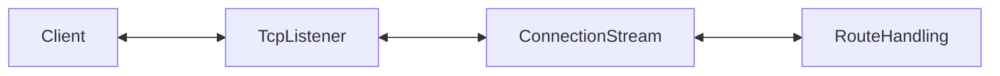
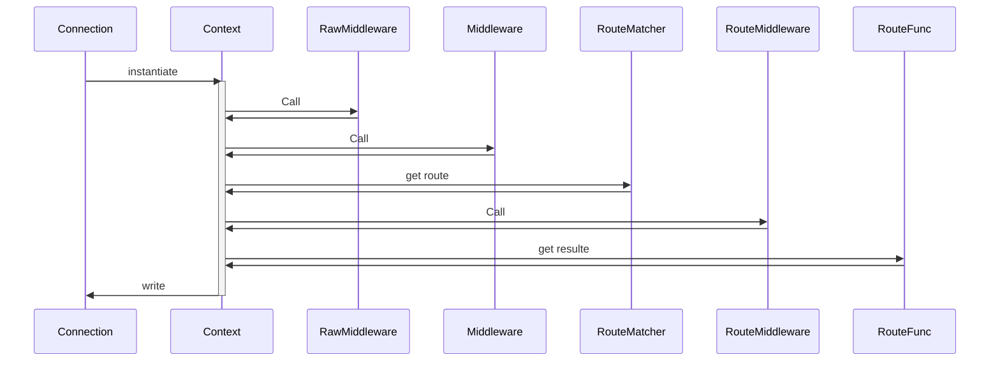
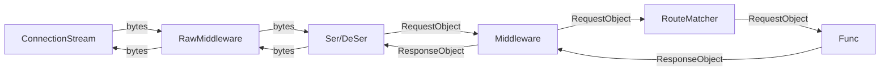
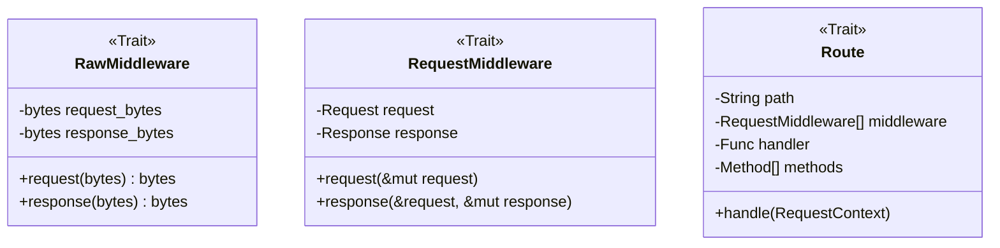
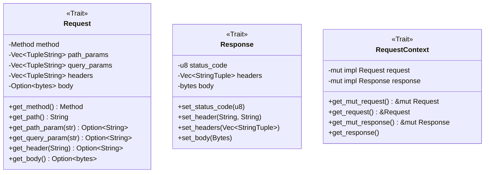

## High level function

## Data Flow

Implementation Order:
- Define traits
- Define default request / responses
- Define default route
- Define request parsing
- define route matching

## Route Handling

### raw middleware:

- do something with the raw data after reading from the tcp socket
- do something with the raw data before writing to the tcp socket

Use cases:
- metrics e.g. num bytes

### request middleware:

- do something with a request object before calling route function
- do something with a response object before sending writing to tcp socket

Use cases:
- Add authentication data to the request
- Transform RequestObject into a custom type
- ErrorHandling

### Route Middleware

same as request middle ware but registered per route

Registering middleware for a group of routes 

### Request object

### Response object

### Request Context

Encapsulate all data for the requests lifecycle
- request object
- response object
- connection metadata
- metrics

### Router

### Route

Message parsing
- http lib

- server / application lib
